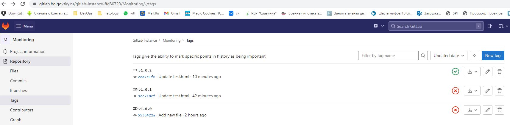

# Ответы приведены в **Ответ:** 9для быстрого поиска).

---

# Дипломный практикум в YandexCloud
  * [Цели:](#цели)
  * [Этапы выполнения:](#этапы-выполнения)
      * [Регистрация доменного имени](#регистрация-доменного-имени)
      * [Создание инфраструктуры](#создание-инфраструктуры)
          * [Установка Nginx и LetsEncrypt](#установка-nginx)
          * [Установка кластера MySQL](#установка-mysql)
          * [Установка WordPress](#установка-wordpress)
          * [Установка Gitlab CE, Gitlab Runner и настройка CI/CD](#установка-gitlab)
          * [Установка Prometheus, Alert Manager, Node Exporter и Grafana](#установка-prometheus)
  * [Что необходимо для сдачи задания?](#что-необходимо-для-сдачи-задания)
  * [Как правильно задавать вопросы дипломному руководителю?](#как-правильно-задавать-вопросы-дипломному-руководителю)

---
## Цели:

1. Зарегистрировать доменное имя (любое на ваш выбор в любой доменной зоне).
2. Подготовить инфраструктуру с помощью Terraform на базе облачного провайдера YandexCloud.
3. Настроить внешний Reverse Proxy на основе Nginx и LetsEncrypt.
4. Настроить кластер MySQL.
5. Установить WordPress.
6. Развернуть Gitlab CE и Gitlab Runner.
7. Настроить CI/CD для автоматического развёртывания приложения.
8. Настроить мониторинг инфраструктуры с помощью стека: Prometheus, Alert Manager и Grafana.

---
## Этапы выполнения:

### Регистрация доменного имени

Подойдет любое доменное имя на ваш выбор в любой доменной зоне.

ПРИМЕЧАНИЕ: Далее в качестве примера используется домен `you.domain` замените его вашим доменом.

Рекомендуемые регистраторы:
  - [nic.ru](https://nic.ru)
  - [reg.ru](https://reg.ru)

Цель:

1. Получить возможность выписывать [TLS сертификаты](https://letsencrypt.org) для веб-сервера.

Ожидаемые результаты:

1. У вас есть доступ к личному кабинету на сайте регистратора.
2. Вы зарезистрировали домен и можете им управлять (редактировать dns записи в рамках этого домена).

**Ответ:** зарегистрировано доменное имя `bolgovsky.ru` на reg.ru, управление делегировано на Yandex Cloud (YC).


### Создание инфраструктуры

Для начала необходимо подготовить инфраструктуру в YC при помощи [Terraform](https://www.terraform.io/).

Особенности выполнения:

- Бюджет купона ограничен, что следует иметь в виду при проектировании инфраструктуры и использовании ресурсов;
- Следует использовать последнюю стабильную версию [Terraform](https://www.terraform.io/).

Предварительная подготовка:

1. Создайте сервисный аккаунт, который будет в дальнейшем использоваться Terraform для работы с инфраструктурой с необходимыми и достаточными правами. Не стоит использовать права суперпользователя
2. Подготовьте [backend](https://www.terraform.io/docs/language/settings/backends/index.html) для Terraform:
   а. Рекомендуемый вариант: [Terraform Cloud](https://app.terraform.io/)  
   б. Альтернативный вариант: S3 bucket в созданном YC аккаунте.
3. Настройте [workspaces](https://www.terraform.io/docs/language/state/workspaces.html)
   а. Рекомендуемый вариант: создайте два workspace: *stage* и *prod*. В случае выбора этого варианта все последующие шаги должны учитывать факт существования нескольких workspace.  
   б. Альтернативный вариант: используйте один workspace, назвав его *stage*. Пожалуйста, не используйте workspace, создаваемый Terraform-ом по-умолчанию (*default*).
4. Создайте VPC с подсетями в разных зонах доступности.
5. Убедитесь, что теперь вы можете выполнить команды `terraform destroy` и `terraform apply` без дополнительных ручных действий.
6. В случае использования [Terraform Cloud](https://app.terraform.io/) в качестве [backend](https://www.terraform.io/docs/language/settings/backends/index.html) убедитесь, что применение изменений успешно проходит, используя web-интерфейс Terraform cloud.

Цель:

1. Повсеместно применять IaaC подход при организации (эксплуатации) инфраструктуры.
2. Иметь возможность быстро создавать (а также удалять) виртуальные машины и сети. С целью экономии денег на вашем аккаунте в YandexCloud.

Ожидаемые результаты:

1. Terraform сконфигурирован и создание инфраструктуры посредством Terraform возможно без дополнительных ручных действий.
2. Полученная конфигурация инфраструктуры является предварительной, поэтому в ходе дальнейшего выполнения задания возможны изменения.

**Ответ:** `ansible` `terraform`  обновлены до последних версий :
```bash
vagrant@vagrant:~/diplom/src/terraform$ ansible --version
ansible [core 2.13.2]
  config file = /home/vagrant/diplom/src/terraform/ansible.cfg
  configured module search path = ['/home/vagrant/.ansible/plugins/modules', '/usr/share/ansible/plugins/modules']
  ansible python module location = /home/vagrant/.local/lib/python3.8/site-packages/ansible
  ansible collection location = /home/vagrant/.ansible/collections:/usr/share/ansible/collections
  executable location = /home/vagrant/.local/bin/ansible
  python version = 3.8.10 (default, Jun 22 2022, 20:18:18) [GCC 9.4.0]
  jinja version = 3.1.2
  libyaml = True

vagrant@vagrant:~/diplom/src/terraform$ terraform --version
Terraform v1.2.6
on linux_amd64
+ provider registry.terraform.io/hashicorp/local v2.2.3
+ provider registry.terraform.io/hashicorp/null v3.1.1
+ provider registry.terraform.io/yandex-cloud/yandex v0.77.0
```

сервисный аккаунт использовался старый, bucket создан вручную, добавлен в `provider.tf` файл для использования.

```yml
  backend "s3" {
    endpoint = "storage.yandexcloud.net"
    bucket   = "netology-diplom-backet"
    region   = "ru-central1"
    key      = "terraform.tfstate" 
    access_key = "YCAJEuU0nHfzi4MbHMOq2bQk_"
    secret_key = "YCMcKQkucbJ3ThlyBoTEf42kfwLjLkT9FTUUUJdt"

    skip_region_validation      = true
    skip_credentials_validation = true
  }
```

Bucket S3 YC:


Добавлены `stage` и `prod` воркспейсы для терраформ, вся работа произведена в воркспейсе `stage`.
```bash
vagrant@vagrant:~/diplom/src/terraform$ terraform workspace list
  default
  prod
* stage
```

Все ресурсы описаны в виде кода terraform:

| Имя файла | Описание | Примечание |
|--------------|-----------------------------|------------------------------------------------|
| [ansible.cfg](./src/terraform/ansible.cfg) | настройки ansible для запуска из terraform|  |
| [dns.tf](./src/terraform/dns.tf) | создание DNS записей в YC DNS|  |
| [inventory.tf](./src/terraform/inventory.tf) | создание файла inventory для последующего запуска ansible|  |
| [key.json](./src/terraform/key.json) | файл ключа для сервисного аккаунта| исключен из репозитория |
| [network.tf](./src/terraform/network.tf) | создание общих сетевых ресурсов|  |
| [node01-nginx.tf](./src/terraform/node01-nginx.tf) | создание ноды для nginx|  |
| [node02-db01.tf](./src/terraform/node02-db01.tf) | создание ноды для db01|  |
| [node03-db02.tf](./src/terraform/node03-db02.tf) |создание ноды для db02 |  другая подсеть в другом регионе|
| [node04-app.tf](./src/terraform/node04-app.tf) | создание ноды для wordpress|  |
| [node05-gitlab.tf](./src/terraform/node05-gitlab.tf) | создание ноды для gitlab|  |
| [node06-runner.tf](./src/terraform/node06-runner.tf) | создание ноды для gitlab-runner|  |
| [node07-monitoring.tf](./src/terraform/node07-monitoring.tf) |создание ноды для prometheus,alertmanager,grafana |  |
| [output.tf](./src/terraform/output.tf) | настройки вывода по результатам создания ресурсов|  |
| [provider.tf](./src/terraform/provider.tf) |  настройки провайдера и бакета|  |
| [variables.tf](./src/terraform/variables.tf) |  настройки переменных |  |


---
### Установка Nginx и LetsEncrypt

Необходимо разработать Ansible роль для установки Nginx и LetsEncrypt.

**Для получения LetsEncrypt сертификатов во время тестов своего кода пользуйтесь [тестовыми сертификатами](https://letsencrypt.org/docs/staging-environment/), так как количество запросов к боевым серверам LetsEncrypt [лимитировано](https://letsencrypt.org/docs/rate-limits/).**

Рекомендации:
  - Имя сервера: `you.domain`
  - Характеристики: 2vCPU, 2 RAM, External address (Public) и Internal address.

Цель:

1. Создать reverse proxy с поддержкой TLS для обеспечения безопасного доступа к веб-сервисам по HTTPS.

Ожидаемые результаты:

1. В вашей доменной зоне настроены все A-записи на внешний адрес этого сервера:
    - `https://www.you.domain` (WordPress)
    - `https://gitlab.you.domain` (Gitlab)
    - `https://grafana.you.domain` (Grafana)
    - `https://prometheus.you.domain` (Prometheus)
    - `https://alertmanager.you.domain` (Alert Manager)
2. Настроены все upstream для выше указанных URL, куда они сейчас ведут на этом шаге не важно, позже вы их отредактируете и укажите верные значения.
2. В браузере можно открыть любой из этих URL и увидеть ответ сервера (502 Bad Gateway). На текущем этапе выполнение задания это нормально!

**Ответ:** создана роль [nginx](./src/ansible/roles/nginx/README.md), в которой кроме nginx реализована выдача сертификатов посредством `certbot`.

```bash
    certbot certonly -d {{ domain }} -d www.{{ domain }} -d gitlab.{{ domain }} -d grafana.{{ domain }} -d alertmanager.{{ domain }} -d prometheus.{{ domain }}
    --email bolgovsky@mail.ru --agree-tos --webroot -w /var/www/{{ domain }}/html --non-interactive
```

файл настроек [https.j2](./src/ansible/roles/nginx/templates/https.j2)  - там указаны все upstream и настройки https.

В итоге DNS-записи имеют следующий вид:


502-ошибку не сохранил, поэтому стразу сертификаты:

  

___
### Установка кластера MySQL

Необходимо разработать Ansible роль для установки кластера MySQL.

Рекомендации:
  - Имена серверов: `db01.you.domain` и `db02.you.domain`
  - Характеристики: 4vCPU, 4 RAM, Internal address.

Цель:

1. Получить отказоустойчивый кластер баз данных MySQL.

Ожидаемые результаты:

1. MySQL работает в режиме репликации Master/Slave.
2. В кластере автоматически создаётся база данных c именем `wordpress`.
3. В кластере автоматически создаётся пользователь `wordpress` с полными правами на базу `wordpress` и паролем `wordpress`.

**Вы должны понимать, что в рамках обучения это допустимые значения, но в боевой среде использование подобных значений не приемлимо! Считается хорошей практикой использовать логины и пароли повышенного уровня сложности. В которых будут содержаться буквы верхнего и нижнего регистров, цифры, а также специальные символы!**

**Ответ:**  создана роль [mysql](./src/ansible/roles/mysql/README.md)

Результаты работы роли:

* db01
```bash 
ubuntu@db01:~$ sudo mysql
...

mysql> show databases;
+--------------------+
| Database           |
+--------------------+
| information_schema |
| mysql              |
| performance_schema |
| sys                |
| wordpress          |
+--------------------+
5 rows in set (0.00 sec)

mysql> select host,user,password_expired,account_locked from mysql.user;
+-----------+------------------+------------------+----------------+
| host      | user             | password_expired | account_locked |
+-----------+------------------+------------------+----------------+
| %         | wordpress        | N                | N              |
| localhost | debian-sys-maint | N                | N              |
| localhost | mysql.infoschema | N                | Y              |
| localhost | mysql.session    | N                | Y              |
| localhost | mysql.sys        | N                | Y              |
| localhost | root             | N                | N              |
+-----------+------------------+------------------+----------------+
6 rows in set (0.00 sec)


mysql> show grants for wordpress;
+----------------------------------------------------------+
| Grants for wordpress@%                                   |
+----------------------------------------------------------+
| GRANT USAGE ON *.* TO `wordpress`@`%`                    |
| GRANT ALL PRIVILEGES ON `wordpress`.* TO `wordpress`@`%` |
+----------------------------------------------------------+
2 rows in set (0.00 sec)

mysql> SHOW MASTER STATUS;
+------------------+----------+--------------+------------------+-------------------+
| File             | Position | Binlog_Do_DB | Binlog_Ignore_DB | Executed_Gtid_Set |
+------------------+----------+--------------+------------------+-------------------+
| mysql-bin.000007 |  1354949 | wordpress    |                  |                   |
+------------------+----------+--------------+------------------+-------------------+
1 row in set (0.00 sec)
```


* db02
```bash
mysql> SHOW REPLICA STATUS\G;
*************************** 1. row ***************************
             Replica_IO_State: Waiting for source to send event
                  Source_Host: db01
                  Source_User: replica_user
                  Source_Port: 3306
                Connect_Retry: 60
              Source_Log_File: mysql-bin.000006
          Read_Source_Log_Pos: 157
               Relay_Log_File: mysql-relay-bin.000001
                Relay_Log_Pos: 4
        Relay_Source_Log_File: mysql-bin.000006
           Replica_IO_Running: Yes
          Replica_SQL_Running: Yes
...


```


___
### Установка WordPress

Необходимо разработать Ansible роль для установки WordPress.

Рекомендации:
  - Имя сервера: `app.you.domain`
  - Характеристики: 4vCPU, 4 RAM, Internal address.

Цель:

1. Установить [WordPress](https://wordpress.org/download/). Это система управления содержимым сайта ([CMS](https://ru.wikipedia.org/wiki/Система_управления_содержимым)) с открытым исходным кодом.


По данным W3techs, WordPress используют 64,7% всех веб-сайтов, которые сделаны на CMS. Это 41,1% всех существующих в мире сайтов. Эту платформу для своих блогов используют The New York Times и Forbes. Такую популярность WordPress получил за удобство интерфейса и большие возможности.

Ожидаемые результаты:

1. Виртуальная машина на которой установлен WordPress и Nginx/Apache (на ваше усмотрение).
2. В вашей доменной зоне настроена A-запись на внешний адрес reverse proxy:
    - `https://www.you.domain` (WordPress)
3. На сервере `you.domain` отредактирован upstream для выше указанного URL и он смотрит на виртуальную машину на которой установлен WordPress.
4. В браузере можно открыть URL `https://www.you.domain` и увидеть главную страницу WordPress.

**Ответ:**  создана роль [app](./src/ansible/roles/app/README.md). В роли , на ноде worpress уже создается `authorized_keys` c нужным ключом для доставки кода Gitlab Runner-ом.

Результаты работы роли:


---
### Установка Gitlab CE и Gitlab Runner

Необходимо настроить CI/CD систему для автоматического развертывания приложения при изменении кода.

Рекомендации:
  - Имена серверов: `gitlab.you.domain` и `runner.you.domain`
  - Характеристики: 4vCPU, 4 RAM, Internal address.

Цель:
1. Построить pipeline доставки кода в среду эксплуатации, то есть настроить автоматический деплой на сервер `app.you.domain` при коммите в репозиторий с WordPress.

Подробнее об [Gitlab CI](https://about.gitlab.com/stages-devops-lifecycle/continuous-integration/)

Ожидаемый результат:

1. Интерфейс Gitlab доступен по https.
2. В вашей доменной зоне настроена A-запись на внешний адрес reverse proxy:
    - `https://gitlab.you.domain` (Gitlab)
3. На сервере `you.domain` отредактирован upstream для выше указанного URL и он смотрит на виртуальную машину на которой установлен Gitlab.
3. При любом коммите в репозиторий с WordPress и создании тега (например, v1.0.0) происходит деплой на виртуальную машину.

**Ответ:**  созданы роли [gitlab](./src/ansible/roles/gitlab/README.md) и [runner](./src/ansible/roles/runner/README.md). Токен для регистрации сгенерирован `uuidgen` и добавлен на gitlab и runner.
Ключи для runner заданы принудительно в роли, чтобы деплоить код в wordpress.

Результаты работы ролей:

* в репозитории готовим файл


* коммитим его


* настраиваем файл пайплайна для доставки кода на удаленный сервер

Файл `.gitlab-ci.yml`:

```yml
before_script:
  - 'command -v ssh-agent >/dev/null || ( apt-get update -y && apt-get install openssh-client -y )'
  - eval $(ssh-agent -s)
  - echo ${SSH_PRIVATE_KEY}
  - echo $CI_PROJECT_DIR
  - echo "${SSH_PRIVATE_KEY}" | tr -d '\r' | ssh-add
  - mkdir -p ~/.ssh
  - chmod 700 ~/.ssh

stages:         
  - deploy

deploy-job:      
  stage: deploy
  only:
    variables:
      - $CI_COMMIT_TAG =~ /v(\d+\.\d+\.\d+)/

  script:
    - echo "start delivery" 
    - ssh -o StrictHostKeyChecking=no runner@app.bolgovsky.ru sudo chown runner -R /var/www/app.bolgovsky.ru/wordpress/
    - rsync -vz -e "ssh -o StrictHostKeyChecking=no" $CI_PROJECT_DIR/* runner@app.bolgovsky.ru:/var/www/app.bolgovsky.ru/wordpress/
    - echo "remove .git repo from host"
    - ssh -o StrictHostKeyChecking=no runner@app.bolgovsky.ru rm -rf /var/www/app.bolgovsky.ru/wordpress/.git
    - echo "set www-data rigths"
    - ssh -o StrictHostKeyChecking=no runner@app.bolgovsky.ru sudo chown www-data -R /var/www/app.bolgovsky.ru/wordpress/ 
    - echo "delivery complete!" 
```

* для запуска пайплайна на нужен тэг вида v1.0.0 :



* наблюдаем , что файлик доставился куда нам надо:


* проверка на удаленном сервере wordpress:


**Всё готово! Код доставлен!**

Себе - использовались статьи: 

* [coderoad.ru](https://coderoad.ru/53966117/%D0%9D%D0%B5-%D1%83%D0%B4%D0%B0%D0%B5%D1%82%D1%81%D1%8F-%D0%BF%D0%BE%D0%BB%D1%83%D1%87%D0%B8%D1%82%D1%8C-%D1%82%D0%BE%D0%BA%D0%B5%D0%BD-%D1%80%D0%B5%D0%B3%D0%B8%D1%81%D1%82%D1%80%D0%B0%D1%86%D0%B8%D0%B8-gitlab-runners-%D0%B8%D0%B7-%D0%91%D0%94)

* [gitlab.rb.template](https://gitlab.com/gitlab-org/omnibus-gitlab/blob/master/files/gitlab-config-template/gitlab.rb.template)


___
### Установка Prometheus, Alert Manager, Node Exporter и Grafana

Необходимо разработать Ansible роль для установки Prometheus, Alert Manager и Grafana.

Рекомендации:
  - Имя сервера: `monitoring.you.domain`
  - Характеристики: 4vCPU, 4 RAM, Internal address.

Цель:

1. Получение метрик со всей инфраструктуры.

Ожидаемые результаты:

1. Интерфейсы Prometheus, Alert Manager и Grafana доступены по https.
2. В вашей доменной зоне настроены A-записи на внешний адрес reverse proxy:
  - `https://grafana.you.domain` (Grafana)
  - `https://prometheus.you.domain` (Prometheus)
  - `https://alertmanager.you.domain` (Alert Manager)
3. На сервере `you.domain` отредактированы upstreams для выше указанных URL и они смотрят на виртуальную машину на которой установлены Prometheus, Alert Manager и Grafana.
4. На всех серверах установлен Node Exporter и его метрики доступны Prometheus.
5. У Alert Manager есть необходимый [набор правил](https://awesome-prometheus-alerts.grep.to/rules.html) для создания алертов.
2. В Grafana есть дашборд отображающий метрики из Node Exporter по всем серверам.
3. В Grafana есть дашборд отображающий метрики из MySQL (*).
4. В Grafana есть дашборд отображающий метрики из WordPress (*).

*Примечание: дашборды со звёздочкой являются опциональными заданиями повышенной сложности их выполнение желательно, но не обязательно.*

**Ответ:**  созданы роли [alertmanager](./src/ansible/roles/alertmanager/README.md), [prometheus](./src/ansible/roles/prometheus/README.md), [grafana](./src/ansible/roles/grafana/README.md).
Данные роли устанавливают все необходимые сервисы на одну ноду (доступ по разным портам) и конфигурируют все , что необходимо.
Источники данных для grafana, как и дашборды, добавлены вручную.

Создана роль [node_exporter](./src/ansible/roles/node_exporter/README.md), которая усанавливается и настроаивается на каждую ноду для получения метрик(и подачи в prometheus и т.д....).

Результаты работы ролей:

* alertmanager


* prometheus


* grafana настройка источника данных для отображения


* grafana dashboard node_exporter_full


* node_exporter


---

**Большое спасибо за внимание!!!**

---
## Что необходимо для сдачи задания?

1. Репозиторий со всеми Terraform манифестами и готовность продемонстрировать создание всех ресурсов с нуля.
2. Репозиторий со всеми Ansible ролями и готовность продемонстрировать установку всех сервисов с нуля.
3. Скриншоты веб-интерфейсов всех сервисов работающих по HTTPS на вашем доменном имени.
  - `https://www.you.domain` (WordPress)
  - `https://gitlab.you.domain` (Gitlab)
  - `https://grafana.you.domain` (Grafana)
  - `https://prometheus.you.domain` (Prometheus)
  - `https://alertmanager.you.domain` (Alert Manager)
4. Все репозитории рекомендуется хранить на одном из ресурсов ([github.com](https://github.com) или [gitlab.com](https://gitlab.com)).

